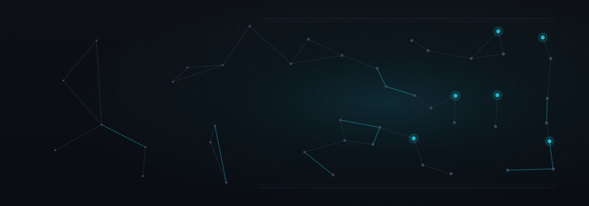
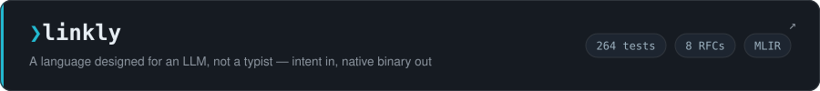
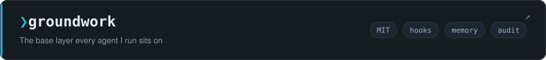
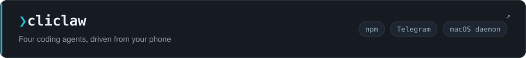

<p align="center">
  
</p>

<p align="center">
  <a href="./README.md">English</a> &nbsp;|&nbsp; <strong>한국어</strong>
</p>

<h1 align="center">최영기 · Younggi Choi</h1>

<p align="center">
  <picture>
    <source media="(prefers-color-scheme: dark)" srcset="./profile/tagline-dark.svg">
    <source media="(prefers-color-scheme: light)" srcset="./profile/tagline-light.svg">
    
  </picture>
</p>

<p align="center">
  <strong>에이전트형 코딩을 위한 안전·검증 레이어 —<br>
  훅, 스킬, MCP 서버로 AI 하네스를 무인 실행해도 될 만큼 신뢰할 수 있게 만듭니다.</strong>
</p>

---

AI 코딩 노력의 대부분은 프롬프트에 들어갑니다. 하지만 진짜 레버리지는 그 한 층 아래 —
**하네스**에 있다고 봅니다: 에이전트가 force-push 하기 직전에 멈춰 세우는 훅, 매 세션마다 다시
유도하지 않도록 절차를 코드로 굳혀 둔 스킬, 추측 대신 진짜 컨텍스트를 건네주는 MCP 서버, 그리고
`/clear` 이후에도 살아남는 메모리. **에이전트는 자신이 놓인 환경만큼만 우수합니다. 그 환경을 만드는 것이
제 일입니다.** 세 개의 프로젝트가 그 작업의 대부분을 담당합니다.

<a href="https://github.com/choiyounggi/linkly">
  <picture>
    <source media="(prefers-color-scheme: dark)" srcset="./profile/card-linkly-dark.svg">
    <source media="(prefers-color-scheme: light)" srcset="./profile/card-linkly-light.svg">
    
  </picture>
</a>

기존 언어들은 *사람이 쓰기* 쉽도록 설계됐습니다. 앞으로 대부분의 코드는 생성됩니다 — 그렇다면
**LLM이 추론하고 최적화하기** 쉽도록 설계된 언어는 어떤 모습일까요?

```
Developer → Intent (무엇을) → LLM → Semantic IR → Native Optimizer → Machine Code
```

목표와 비즈니스 규칙을 선언하면, 컴파일러와 에이전트 파이프라인이 나머지를 설계·구현·검증·최적화합니다.
`.lnpl`은 파싱되어 시맨틱 IR로 낮춰지고, IR 인터프리터에서 실행되는 **동시에 MLIR을 거쳐 네이티브
바이너리로 컴파일**됩니다 — 그리고 차분(differential) 검사가 두 실행 모드가 실행 순서·정책 결과·관측
신호·마스킹에서 일치하는지 확인합니다. OpenAPI는 IR에서 생성됩니다. 다음: 커스텀 `lnpl` MLIR 방언.

<a href="https://github.com/choiyounggi/groundwork">
  <picture>
    <source media="(prefers-color-scheme: dark)" srcset="./profile/card-groundwork-dark.svg">
    <source media="(prefers-color-scheme: light)" srcset="./profile/card-groundwork-light.svg">
    
  </picture>
</a>

가드레일 훅, 메모리 시스템, 스킬 아키텍처, 감사 로깅 — 제가 돌리는 모든 에이전트가 올라서는 베이스
레이어. *모든 것*에 매칭되는 가드 정규식은 아무것도 매칭하지 않는 것과 구분되지 않는다는 걸 어렵게
배운 뒤에 작성했습니다. 그래서 훅들은 양방향 회귀 테스트를 함께 배포합니다: 언급은 통과하고, 실행은
차단됩니다. 속여보려 시도해 본 적 없는 가드는 장식일 뿐입니다.

<a href="https://github.com/choiyounggi/cliclaw">
  <picture>
    <source media="(prefers-color-scheme: dark)" srcset="./profile/card-cliclaw-dark.svg">
    <source media="(prefers-color-scheme: light)" srcset="./profile/card-cliclaw-light.svg">
    
  </picture>
</a>

```bash
npm install -g @younggichoi/cliclaw
```

Claude Code, Codex, Pi, Gemini CLI를 macOS 데몬으로 구동하는 텔레그램 봇. 채팅별 에이전트 세션,
파괴적 작업 전 확인 게이트, 응답 스트리밍, 이미지 첨부, launchd 자동 설치, 그리고 사내
TLS(Zscaler) 자동 감지.

---

## 나머지 하네스

| | |
| --- | --- |
| **[claude-secretmode](https://github.com/choiyounggi/claude-secretmode)** | 흔적을 남기지 않는 Claude Code 세션 — RAM 디스크에서 실행되어 트랜스크립트·프롬프트 기록·파일 스냅샷이 디스크에 닿지 않으면서도, 키체인 인증·MCP 서버·훅·스킬은 그대로 상속합니다. `npm i -g @younggichoi/claude-secretmode` |
| **[dev-loop](https://github.com/choiyounggi/dev-loop)** | 코딩 에이전트를 위한 지식 관리 — 위키 기반 검증, RFC 기반 문서, 그리고 매번 재학습되는 대신 다음 작업으로 이어지는 베스트 프랙티스 캡처. |
| **[loop-orchestrator](https://github.com/choiyounggi/loop-orchestrator)** | 멀티 에이전트 오케스트레이션 — 병렬 실행, TDD/PDCA/Reflexion 루프, 테스트 품질 감사, 머지 게이트 검증. |
| **[dev-llm-wiki](https://github.com/choiyounggi/dev-llm-wiki)** | 케이스 라우팅되는 엔지니어링 지식 — 사람이 읽기 위해서가 아니라, 에이전트가 최소 작업 컨텍스트로 로드하도록 작성됨. 한 페이지에 한 케이스, 도메인으로 라우팅. |
| **[awesome-claude-plugins](https://github.com/choiyounggi/awesome-claude-plugins)** | Claude Code를 커맨드·에이전트·훅·MCP 서버로 확장하는 플러그인 모음. |
| **[awesome-cli-coding-agents](https://github.com/choiyounggi/awesome-cli-coding-agents)** | 터미널 네이티브 코딩 에이전트와 이를 오케스트레이션하는 하네스 — Pi, OpenCode, Aider, Goose, Claude Code, Codex, Gemini CLI, 병렬 러너, 자율 루프. |

<details>
<summary><strong>그 외 출시작</strong> — 서비스와 유틸리티</summary>

<br>

| | |
| --- | --- |
| **[korea-data-suite](https://github.com/choiyounggi/korea-data-suite)** | 한국 공공데이터를 감싼 깔끔한 REST API — 전국 부동산 실거래가(국토부)와 공휴일(천문연)을 평이한 영어 JSON으로 정규화. |
| **[chungyak-alimi](https://github.com/choiyounggi/chungyak-alimi)** | 공식 오픈 API에서 청약 공고를 PostgreSQL로 수집해 조건과 매칭하고, 텔레그램으로 푸시, FastAPI 대시보드에서 필지 폴리곤과 함께 조회. 라즈베리 파이에서 systemd로 구동. |
| **[mac-inputlock](https://github.com/choiyounggi/mac-inputlock)** | 화면은 켜둔 채 맥의 키보드와 마우스를 잠급니다 — `⌃⌥⌘L`. 키보드 청소용, 또는 고양이 방지용. |
| **[meetingSummary](https://github.com/choiyounggi/meetingSummary)** | macOS에서 온디바이스 회의 전사 및 요약. |
| **[ai-gossip](https://github.com/choiyounggi/ai-gossip)** | 여러 모델이 당신이 자리를 비웠다고 여길 때 서로에 대해 하는 말. |

</details>

## 활동

<p align="center">
  <picture>
    <source media="(prefers-color-scheme: dark)" srcset="./profile/stats-dark.svg">
    <source media="(prefers-color-scheme: light)" srcset="./profile/stats-light.svg">
    
  </picture>
  <picture>
    <source media="(prefers-color-scheme: dark)" srcset="./profile/langs-dark.svg">
    <source media="(prefers-color-scheme: light)" srcset="./profile/langs-light.svg">
    
  </picture>
</p>

<p align="center">
  <picture>
    <source media="(prefers-color-scheme: dark)" srcset="https://streak-stats.demolab.com/?user=choiyounggi&hide_border=true&theme=github-dark&ring=22B8CF&fire=22B8CF&currStreakLabel=22B8CF">
    <source media="(prefers-color-scheme: light)" srcset="https://streak-stats.demolab.com/?user=choiyounggi&hide_border=true&theme=default&ring=0B7285&fire=0B7285&currStreakLabel=0B7285">
    
  </picture>
</p>

<p align="center">
  <sub>카드는 <a href="./.github/workflows/readme-cards.yml">예약된 워크플로우</a>가 생성해 이 레포에 커밋합니다. 그래서 공개 위젯 호스트가 다운돼도 깨지지 않습니다.</sub>
</p>

---

<p align="center">
  공개적으로 만들어 갑니다. 에이전트 하네스, MCP, LLM 자동화를 하신다면<br>
  위 어느 저장소에든 이슈를 열어주세요 — 답변드립니다.
</p>
